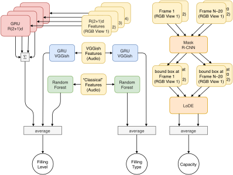

- [The CORSMAL Challenge 2020 Submission](#the-corsmal-challenge-2020-submission)
  - [Team 👋](#team-)
  - [Task](#task)
  - [Dataset 🥤📘🥛](#dataset-)
  - [Code organization](#code-organization)
  - [How to run evaluation?](#how-to-run-evaluation)
  - [How to train a new model?](#how-to-train-a-new-model)
  - [License](#license)

# The CORSMAL Challenge 2020 Submission

- 🏆 The Top-1 Submission to [CORSMAL Challenge 2020 (ICPR Challenge)](https://corsmal.eecs.qmul.ac.uk/ICPR2020challenge.html).
- 🏆 The Winning Solution (in all sub-tasks) to the 3-day competition on the CORSMAL challenge organized among participants of the [Intelligent Sensing Summer School (1–4 September 2020)](http://cis.eecs.qmul.ac.uk/school2020.html).

The design of an individual model for each sub-task: container filling level (left), filling type (middle) classification, and container capacity estimation (right).



For the **filling level** estimation we rely on both modalities: RGB (R(2+1)d features) and audio ("classical" and VGGish features). In particular, we encode streams from each camera placed at different view points with the individual GRU models. Next, we sum up the logits and apply softmax at the output. Next, we process VGGish featured extracted from the audio stream and process it with another GRU model which outputs the class probabilities. Then, the "classical" features are classified with the random forest algorithm. Finally, the probabilities from all three models are averaged to produce the final prediction for the filling level.

The procedure for **filling type** classification resembles the one for the filling level except for the absence of RGB stream.

The **capacity estimation** pipeline starts with the extraction of two frames from one camera view: the 1st and the 20th frames to the end. Both frames are passed through the Mask R-CNN to detect a container. The detected bounding boxes are used to crop both frames. The crops are sent to the LoDE model which outputs the estimation of the container capacity. If an object was not detected on either of the frames, we use the training prior.

## Team 👋
- Gokhan Solak ([LinkedIn](https://www.linkedin.com/in/gkhnsolak/), g.solak@qmul.ac.uk)
- Francesca Palermo ([LinkedIn](https://www.linkedin.com/in/francesca-palermo-a9107a40/), f.palermo@qmul.ac.uk)
- Claudio Coppola ([LinkedIn](https://www.linkedin.com/in/clcoppola/), c.coppola@qmul.ac.uk)
- Vladimir Iashin ([LinkedIn](https://www.linkedin.com/in/vladimir-iashin/), vladimir.d.iashin@gmail.com)

## Task
The CORSMAL challenge focuses on the estimation of the weight of containers which depends on the presence of a filling and its amount and type, in addition to the container capacity. Participants should determine the physical properties of a container while it is manipulated by a human, when both containers and fillings are not known a priori.

Technically, the main task requires to estimate the  overall  filling  mass  estimation. This quantity can be estimated by solving three sub-tasks:
- Container capacity estimation (any positive number)
- Filling type classification (boxes: pasta, rice; glasses/cups: water, pasta, rice; or nothing (empty))
- Filling level classification (0, 50, 90%)

## Dataset 🥤📘🥛
- Download the CORSMAL dataset [here](http://corsmal.eecs.qmul.ac.uk/containers_manip.html)
- The dataset consists of **15 containers**: 5 drinking cups, glasses, and food boxes. These containers are made of different materials, such as **plastic**, **glass**, and **paper**.
- A container can be **filled with water** (only glasses and cups), **rice or pasta** at 3 different levels of **0, 50, and 90%** with respect to the capacity of the container.
- All different combinations of containers are executed by a **different subject** (12) for each **background** (2) and **illumination** condition (2). The total number of configurations is **1140**.
- Each event in the dataset is acquired with several sensors, making the CORSMAL dataset to be **multi-modal**
    - 4 cameras (1280x720@30Hz):
        - RGB,
        - narrow-baseline stereo infrared,
        - depth images,
        - inertial measurements (IMU)
        - calibration
    - 8-channel 44.1 kHz audio;

## Code organization

Each folder in this repo corresponds to a dedicated task. Filling level and types have two or three different approaches and, hence, each approach has an individual folder.
- `/capacity`
- `/filling_level`
    - `/CORSMAL-pyAudioAnalysis`
    - `/r21d_rgb`
    - `/vggish`
    - `README.md`
- `/filling_type`
    - `/CORSMAL-pyAudioAnalysis`
    - `/r21d_rgb`
    - `/vggish`
    - `README.md`

## How to run evaluation?

We recommend to use our docker image to run the evaluation script. (To experement with different approaches, inspect individual README files inside of the task folders.) Another way to run it without docker is to install the environments using the commands from `Dockerfile` (ignore the first 11 lines) and execute `run_eval.sh` script.

Running the script will take <4 hours on 10-core i9-7900X X-series, 4x1080Ti (one gpu is enough), RAM 64Gb (or at least 20Gb but the more GPU you will use the more RAM it will allocate), 40Gb of extra disk space (besides the dataset).

[Install docker](https://docs.docker.com/engine/install/) (19.03.13) and run our script
```bash
# pull our image from the docker hub
docker pull iashin/corsmal:latest

# source: the path to dir with corsmal on the host; destination: path where the sorce folder will be mounted
# if you would like to attach shell (and debug) just append `/bin/bash` to the command above
# because, by default, it will run the evaluation script
# Also, the script will work even with just one GPU but if you would like to speed up the 1st part try more
docker run \
    --mount type=bind,source=/path/to/corsmal/,destination=/home/ubuntu/CORSMAL/dataset/ \
    -it --gpus '"device=0,1,2,3"' \
    iashin/corsmal:latest

# copy submission files from the container once it finishes running the script
docker cp container_id:/home/ubuntu/CORSMAL/submission_public_test.csv .
docker cp container_id:/home/ubuntu/CORSMAL/submission_private_test.csv .
```

The expected structure of the `DATA_ROOT` folder:
```
DATA_ROOT
├── [1-9]
│   ├── audios
│   │   └── sS_fiI_fuU_bB_lL_audio.wav
│   ├── calib
│   │   └── sS_fiI_fuU_bB_lL_cC_calib.pickle
│   ├── depth
│   │   └── sS_fiI_fuU_bB_lL
│   ├── ir
│   │   └── sS_fiI_fuU_bB_lL_cC_irR.mp4
│   └── rgb
│       └── sS_fiI_fuU_bB_lL_cC.mp4
└── [10-15]
    ├── audio
    │   └── XXXX
    ├── calib
    │   └── XXXX_cC_calib.pickle
    ├── depth
    │   └── XXXX
    ├── ir
    │   └── XXXX_cC_irR.mp4
    └── rgb
        └── XXXX_cC.mp4
```

Please note, we undertook extreme care to make sure our results are reproducible by fixing the seeds, sharing the pre-trained models, and package versions. However, the training on another hardware might give you _slightly_ different results. We observed that the change is 🤏  `<0.01`.

## How to train a new model?
Please follow the instructions provided in `filling_level` and `filling_type`. Note, we do not use any training for `capacity` sub-task but you still can adapt the code to apply it on your dataset.

## License
We distribute our code under MIT licence. Yet, our code relies on libraries which have different licence.
- LoDE (container capacity): Creative Commons Attribution-NonCommercial 4.0
- pyAudioAnalysis (filling level and type): Apache-2.0 License
- video_features (filling level and type): [check here: ](https://github.com/v-iashin/video_features/tree/e0eba1b738e3ec7db81c3584581e53eb9df06665)
